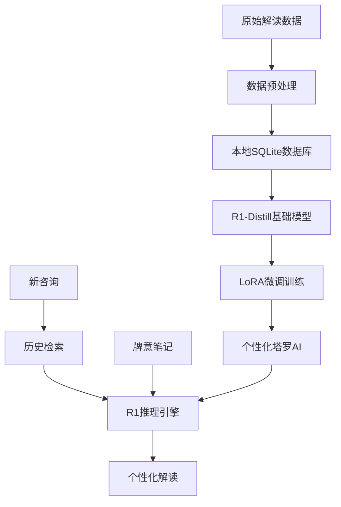

# R1 LoRA 塔罗解读系统

## 📋 系统概述

这个目录包含了基于DeepSeek R1的塔罗解读AI系统的完整实现，采用本地LoRA微调技术，完全保护数据隐私。

## 🗂️ 文件结构

```
models/r1_lora_system/
├── README.md                    # 本文档
├── test_pure_r1.py             # R1 API测试和深度学习框架
├── test_vector_rag.py           # 向量RAG vs SQL检索对比测试
├── local_lora_training.py       # 本地LoRA微调训练脚本
└── lora_comparison.md           # LoRA技术对比分析
```

## 🚀 系统特性

### 🔒 隐私保护
- **100%本地训练**：所有数据不离开MacBook
- **私有模型**：微调后的模型完全属于你
- **零数据上传**：训练过程无需互联网连接

### 💪 技术优势
- **R1推理能力**：具备DeepSeek R1的深度思考能力
- **LoRA高效训练**：只训练0.3%参数，节省时间和资源
- **M4硬件优化**：针对Apple Silicon MPS加速优化

### 🎯 解读质量
- **深度分析**：学习你的解牌思维和方法论
- **个人化理解**：深度理解每个咨询者的特质
- **牌意精准**：结合你的牌意笔记和历史解读

## 📊 系统架构



## 🔧 使用指南

### 1. 环境检查
```bash
python local_lora_training.py
# 选择: 1. 检查硬件兼容性
```

### 2. 开始训练
```bash
python local_lora_training.py  
# 选择: 3. 开始本地训练
```

### 3. 测试模型
```bash
python local_lora_training.py
# 选择: 4. 测试本地模型
```

### 4. 使用解读系统
```bash
python test_pure_r1.py
```

## 💾 硬件需求

| 配置 | 要求 | 你的硬件 | 状态 |
|------|------|----------|------|
| 内存 | 8-12GB可用 | 24GB总量 | ✅ |
| GPU | Apple M4 MPS | M4 | ✅ |
| 存储 | 30GB空闲 | SSD | ✅ |

## ⚙️ 配置选项

### 内存优化配置
- **4bit量化**：减少75%内存占用
- **梯度检查点**：用时间换空间
- **动态批处理**：根据内存自动调整

### 模型选择
1. **R1-Distill-7B + 4bit**: 推荐配置，平衡性能和内存
2. **R1-Distill-1.5B**: 内存受限时的备选
3. **R1-Distill-7B FP16**: 内存充足时的最佳配置

## 📈 训练进度

### 预估时间（M4 MacBook Air）
- 数据准备: 10-20分钟
- 模型下载: 15-30分钟（首次）
- LoRA训练: 2-4小时
- 总耗时: 3-5小时

### 成本估算
- 电费: ~$1-2
- 云GPU: $0（完全本地）
- 时间成本: 一个下午

## 🔍 系统监控

### 内存监控
```python
# 实时监控内存使用
monitor_memory_usage()
```

### 训练监控
- 实时loss显示
- 梯度范数监控
- 内存使用预警

## 🎯 质量对比

| 方案 | 推理能力 | 个性化 | 隐私 | 成本 |
|------|----------|--------|------|------|
| **本地R1-LoRA** | ⭐⭐⭐⭐⭐ | ⭐⭐⭐⭐⭐ | ⭐⭐⭐⭐⭐ | ⭐⭐⭐⭐⭐ |
| R1 API | ⭐⭐⭐⭐⭐ | ⭐⭐⭐ | ⭐ | ⭐⭐⭐ |
| Qwen微调 | ⭐⭐ | ⭐⭐⭐⭐ | ⭐⭐⭐⭐⭐ | ⭐⭐⭐⭐ |

## 🔧 故障排除

### 内存不足
1. 关闭浏览器和其他应用
2. 选择4bit量化
3. 使用1.5B模型

### 训练失败
1. 检查数据格式
2. 验证模型下载
3. 清理系统缓存

### 质量不佳
1. 增加训练数据
2. 调整学习率
3. 延长训练时间

## 📚 相关文档

- `lora_comparison.md`: LoRA技术详细对比
- `test_pure_r1.py`: R1深度学习实现
- `test_vector_rag.py`: 检索系统优化

## 🌟 未来计划

### 短期优化
- [ ] 支持更多卡牌meaning注释
- [ ] 优化训练数据预处理
- [ ] 添加模型评估指标

### 长期发展
- [ ] 支持多种牌阵类型
- [ ] 集成图像识别
- [ ] 开发网页界面

## 🤝 技术支持

如有问题，请检查：
1. 硬件兼容性
2. 依赖库安装
3. 数据格式正确性
4. 内存使用情况

---

*最后更新: 2024年7月31日*  
*系统版本: R1-LoRA v1.0* 